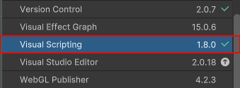
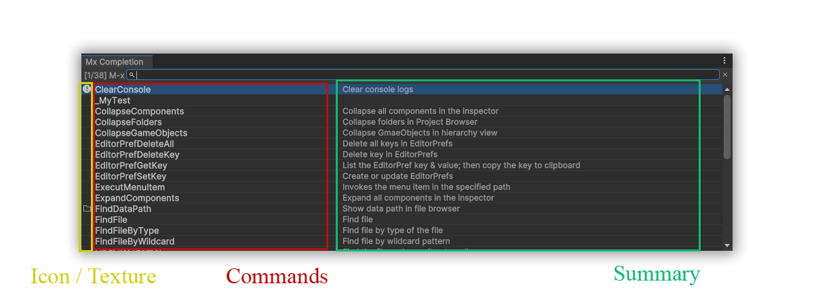

<br/><br/>

<p align="center">

</p>

<p align="center">
<a href="https://git.io/typing-svg"></a>
</p>

<p align="center">
<a href="https://opensource.org/licenses/MIT"></a>
<a href="https://unity3d.com/get-unity/download/archive"></a>
<a href="https://docs.unity3d.com/2018.3/Documentation/Manual/ScriptingRuntimeUpgrade.html"></a>
<a href="https://github.com/jcs090218/Unity.Mx/releases/latest"></a>
</p>

<p align="center">
<a href="https://openupm.com/packages/com.jcs090218.mx/"></a>
<a href="https://openupm.com/packages/com.jcs090218.mx/"></a>
</p>

> M-x for Unity

Mx (or Meta-X) is a command-based completion framework. It allows you to execute
all kinds of tasks based on your design. Mx is an alternate to attribute
`MenuItem`; by contrast, doing multiple tasks is possible. It gives you the
option to choose and explore unnoticed commands.

<p align="center">
<a href="https://www.youtube.com/watch?v=26LAAAwo9Ao">

</a>
</p>

<!-- markdown-toc start - Don't edit this section. Run M-x markdown-toc-refresh-toc -->
**Table of Contents**

- [🏆 Features](#-features)
- [💾 Installation](#-installation)
- [🔨 Usage](#-usage)
  - [❓ How to define your own command?](#-how-to-define-your-own-command)
  - [⚛ `Interactive` Attribute's Properties](#-interactive-attributes-properties)
    - [🧪 summary (`string`)](#-summary-string)
    - [🧪 icon (`string`)](#-icon-string)
    - [🧪 tooltip (`string`)](#-tooltip-string)
    - [🧪 enabled (`boolean`)](#-enabled-boolean)
- [🧰 Advanced Usage](#-advanced-usage)
  - [⚙ CompletingRead (`prompt`, `collection`, `callback`, `hover`, `requiredMatch`)](#-completingread-prompt-collection-callback-hover-requiredmatch)
  - [⚙ ReadString (`prompt`, `callback`)](#-readstring-prompt-callback)
  - [⚙ ReadNumber (`prompt`, `callback`)](#-readnumber-prompt-callback)
  - [⚙ YesOrNo (`prompt`, `callback`)](#-yesorno-prompt-callback)
- [📌 Credits](#-credits)
- [🔍 See Also](#-see-also)
- [⚜️ License](#-license)

<!-- markdown-toc end -->

## 🏆 Features

This part of the document explains what Mx is trying to aim for!

- Search Assets
- Search GameObjects by various way (`Type`, `tag`, `name`, etc)
- Execute Menu
- Get/Set `EditorPrefs` and `PlayerPrefs`
- Visually see things in action (hover event)
- Configurable & Extensible

and more!

## 💾 Installation

Go to our [release page](https://github.com/jcs090218/Unity.Mx/releases) and download the latest `.unitypackage`.
Then simply import it to your project!

Or install it through [OpenUPM](https://openupm.com/packages/com.jcs090218.mx/):

```sh
$ openupm add com.jcs090218.mx
```

This package requires the `Visual Scripting` package to be installed.
Make sure you have it installed!



## 🔨 Usage

Hit <kbd>Alt</kbd>+<kbd>x</kbd>!

### ❓ How to define your own command?

Here is a simple example that prints out `"Hello World!~"` with `Debug.Log`.

```cs
[Interactive(summary: "Print Hello World!")]
private static void PrintHelloWorld()
{
    Debug.Log("Hello World!~");
}
```

But you need to define under a class inherit `Mx`!

```cs
using UnityEngine;
using Mx;  // For InteractiveAttribute.cs

public class DummyCommands : Mx.Mx
{
    // Place your command function here!
}
```

You can see all more advanced examples in our source code, under
[Assets/Mx/Editor/Commands][]!

### ⚛ `Interactive` Attribute's Properties

This part of the document explains all properties inside the `Interactive`
attribute.



#### 🧪 summary (`string`)

A brief description of your command. It will appear on the right of your
command name.

#### 🧪 icon (`string`)

The name of the icon.

See the full list of icons in [unity-editor-icons][].

#### 🧪 tooltip (`string`)

The full description of your command. It will appear in the popup window when
you hover with your mouse.

#### 🧪 enabled (`boolean`)

Enable/Disable your command. If the value is `false`, it will not be shown
inside the completion window.

## 🧰 Advanced Usage

Mx provides some functions to accomplish more complex tasks.

### ⚙ CompletingRead (`prompt`, `collection`, `callback`, `hover`, `requiredMatch`)

Allows you to receive input from the user but limits their answer to the prompt.

```cs
CompletingRead("What's your favorite animal: ", 
    new List<string>() { "Cat", "Dog" }, 
    (answer, _) =>
    {
        Debug.Log("My favorite animal is " + answer);
    });
```

This is the most commonly used function since you can accomplish any task with
it.

### ⚙ ReadString (`prompt`, `callback`)

A function allows users to input an arbitrary string.

```cs
ReadString("What is your name? ", 
    (answer, _) =>
    {
        Debug.Log("My name is " + answer);
    });
```

### ⚙ ReadNumber (`prompt`, `callback`)

A function allows users to input an arbitrary number.

```cs
ReadNumber("What is your age? ", 
    (answer, _) =>
    {
        Debug.Log("My age is " + answer);
    });
```

The result is a string, but you can parse it with `int.Parse` or `float.Parse`.

### ⚙ YesOrNo (`prompt`, `callback`)

The simplest function that only accepts `Yes` or `No`.

```cs
YesOrNo("Do you like Cat? ", 
    (answer, _) =>
    {
        switch (answer)
        {
            case "Yes":
                Debug.Log("Great! I like it too!");
                break;
            case "No":
                // Do something else
                break;
        }
    });
```

## 📌 Credits

This part of the document lists projects that I've used as references to develop Mx.

- [Find Editor Tools][] by **`@phwitti`** - UI extracted here
- [FlxCs][] by **`@jcs090218`** - Fuzzy matching library
- [Prefs][] by **`@jcs090218`** - Retrieved list of `EditorPrefs`/`PlayerPrefs`

Any other supported projects:

- [readme-typing-svg][] by **`@DenverCoder1`**

## 🔍 See Also

- [Find Editor Tools][] - Command Palette for Unity
- [ReUniter][] - Better Search For Unity
- [QuickSearch][] - A Command Palette for Unity

## ⚜️ License

Copyright (c) Jen-Chieh Shen. All rights reserved.

See [`LICENSE`](./LICENSE) for details.


<!-- Links -->

[Assets/Mx/Editor/Commands]: https://github.com/jcs090218/Unity.Mx/tree/master/Assets/Mx/Editor/Commands
[unity-editor-icons]: https://github.com/halak/unity-editor-icons

[Find Editor Tools]: https://github.com/phwitti/unity-find-editor-tools
[FlxCs]: https://github.com/jcs090218/FlxCs
[Prefs]: https://github.com/jcs090218/Unity.Prefs
[readme-typing-svg]: https://github.com/DenverCoder1/readme-typing-svg

[ReUniter]: https://assetstore.unity.com/packages/tools/utilities/reuniter-better-search-for-unity-28691
[QuickSearch]: https://github.com/appetizermonster/Unity3D-QuickSearch
